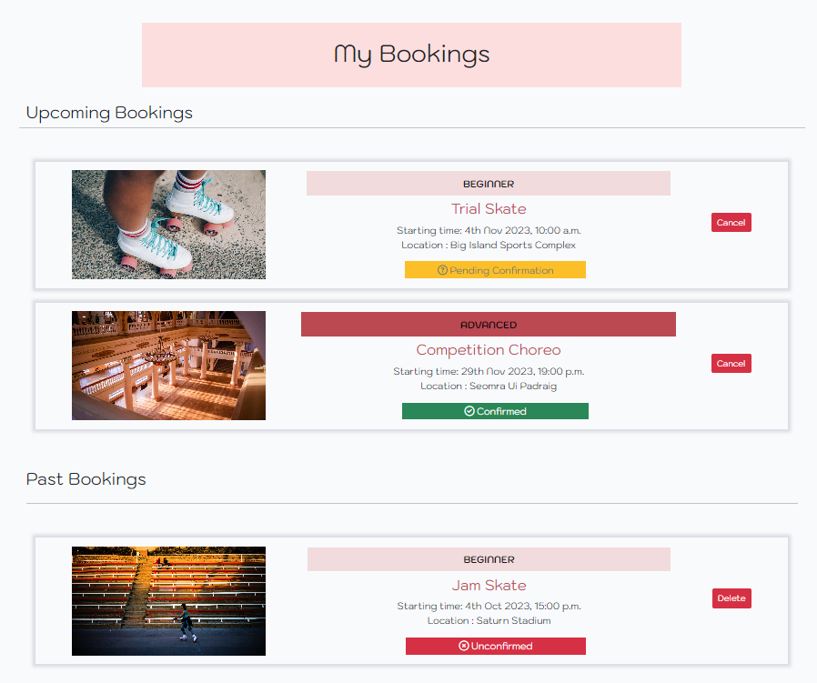
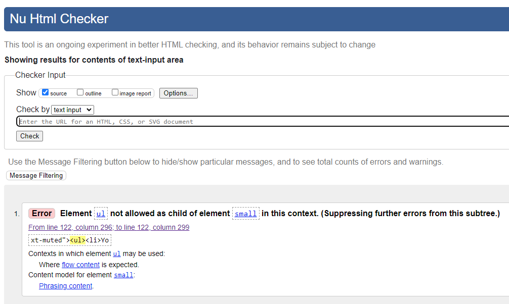
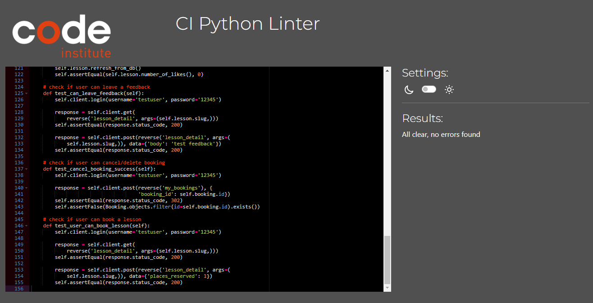

<h1 align="center">Roller Criú</h1>

[View the live project here](https://roller-criu-54a9c256735c.herokuapp.com/)

Roller Criú is a website for a fictional roller skating school based in Cork, Co. Cork, Ireland.

Guest users can visit the website and view the lists of lessons available, the About page that displays the details of Roller Criú, or submit a contact form if they want to send a message. 

If the Guest users want to access more functionality such as: like/unlike lessons, submit a booking request, view and manage their bookings. The user must be registered and logged in to access those functions.

## Table of Contents
---
* [User Experience](#user-experience)
* [Features](#features)
* [Design](#design)
* [Technologies Used](#technologies-used)
* [Testing](#testing)
* [Deployment](#deployment)
* [Credits](#credits)

## User Experience

### User Stories :

* **USER STORY (#1)** : Gather ideas and general requirements for the project.
  * As a **developer**, I can **visualise how the website should be designed**, so that **the website gets developed methodically**.

* **USER STORY (#2)** : Initial Django project setup
  * As a **developer**, I can **set up the developing environment and deploy to Heroku**, so that **I can solve any deployment issue that arises early on**.
* **USER STORY (#3)** : Create bootstrap template
  * As a **developer**, I can **create an essential website using Bootstrap**, so that **it meets my site's requirements**.
* **USER STORY (#4)** : Demonstrate the application's purpose using its user interface
  * As a **Site User**, I can **visit the website**, so that **I can understand and determine the purpose of the website**.
* **USER STORY (#5)** : Navigate site
  * As a **Site user**, I can **navigate the website using the menu**, so that **I can easily access the website's functionality**.
* **USER STORY (#6)** : View lessons list
  * As a **Site User**, I can **view a list of lessons**, so that **I can select one to access for more details**.
* **USER STORY (#7)** : View lesson information
  * As a **Site User**, I can **click on a lesson**, so that **I can view the full details of the lesson**.
* **USER STORY (#8)** : Book a lesson
  * As a **Site User**, I can **submit a lesson booking request**, so that **a place reserved for me**.
* **USER STORY (#9)** : View booked lessons
  * As a **Site user**, I can **access the list of lessons that I have sent a booking request**, so that **I can see if my lessons have been approved or not**.
* **USER STORY (#10)** : Cancel a lesson booking
  * As a **Site user**, I can **cancel a lesson booking request**, so that **the place is no longer reserved for me**.
* **USER STORY (#11)** : View likes on a lesson
  * As a **Site User**, I can **view the number of likes on each lesson**, so that **I can see which is the most popular**.
* **USER STORY (#12)** : Like / Unlike a lesson
  * As a **Site User**, I can **like or unlike a lesson**, so that **I can give quick feedback on my experience**.
* **USER STORY (#13)** : Feedback on a lesson
  * As a **Site User**, I can **leave feedback on the lesson**, so that **give more detailed feedback on my experience**.
* **USER STORY (#14)** : View Feedback
  * As a **Site user**, I can **view feedback on individual lessons**, so that **I can use the feedback to help me make a decision to submit a booking request or not**.
* **USER STORY (#15)** : Approve/Not Approve feedback
  * As a **Site Admin**, I can **approve or not approve feedback**, so that **I can filter out unsuitable or objectionable feedback**.
* **USER STORY (#16)** : Create a lesson draft
  * As a **Site Admin**, I can **create a draft for a lesson**, so that **I can come back to finish writing the lesson details later**.
* **USER STORY (#17)** : Manage Lesson
  * As a **Site Admin**, I can **create, read, update and delete lessons**, so that **I can manage lesson availability and site's content**.
* **USER STORY (#18)** : Account registration & Login
  * As a **Site user**, I can **register an account**, so that **I can log in to book, leave feedback, and/or like a lesson**.
* **USER STORY (#19)** : Manage Coach
  * As a **Site Admin**, I can **create, read, update and delete coaches**, so that **I can manage coaches content**.
* **USER STORY (#20)** : Create a coach draft
  * As a **Site Admin**, I can **create a draft for a coach**, so that **I can come back to finish writing the class details later**.
* **USER STORY (#21)** : Approve bookings
  * As a **Site Admin**, I can **review and approve or disapprove a booking request**, so that **I can manage the capacity of the lesson**.
* **USER STORY (#22**) : View Contact Form
  * As a **Site User**, I can **visit the contact form page**, so that **I can fill out the form to submit my message**.

## Features

### Existing Features

* **Feature (#1)** : Navigation bar
  * The navigation bar's design and placement is consistent on every page.
  * The navigation bar features the brand's Logo, Home, About, and Contact links.
  * If the user is not logged in, the user can see links that take them to the Register and Login page.
  * If the user is logged in, the user can see My Bookings link and Logout link instead of Register and Login.
  * The same applies to an Admin user, with an additional of Admin link that takes the Admin to the Admin panel.
  * The navigation bar is fully responsive on multiple screen sizes. On smaller screens, the links collapse into a "Hamburger" style menu

  
  
  
  
  
  
  

* **Feature (#2)** : Landing Page
  * The landing page features an image and a text overlay to welcome the user and to clearly display the purpose of the website as a place to learn how to roller skate.

  

* **Feature (#3)** : Lesson Lists
  * Just below the welcome image and text overlay, the user can find the list of lessons that have been added and published by the Admin.
  * The list shows a summarised version of the lesson's details. The details that are included in this are the featured image, difficulty level, the title of the lesson, lesson start time, duration, location, and number of likes.
  * To make sure that the landing page is not overcrowded with the lesson summaries, the limit has been set to a maximum of 6 lessons per page. With the help of pagination, the user can navigate to the rest of the lessons by clicking NEXT or PREV.

  

* **Feature (#4)** : Lesson Details Page
  * When the user clicks on the title of a lesson from the lesson list, they will be taken to the Lesson Details page.
  * The Lesson Details page shows full details of the lesson such as the featured image, difficulty level, title, lesson start time, duration, full description of the lesson.
  * Next to the featured image, the user can find the Coach's picture, name, and specialization.
  * Underneath the Coach's info, the user can submit a booking request [Feature (#7)] if the user is logged in.
    * If the user is not logged in, the form button will be disabled and a message will display that the user must log in to book a lesson.
  * Below, the user can find the counter for likes [Feature (#6)] and Feedback [Feature (#5)]
  * Below that, the user can see the feedback that has been approved by the admin showing up in this section.

  

* **Feature (#5)** : Feedback
  * If the user wishes to leave feedback, they must be logged in. If they don't have an account they can simply register.
  * When the user logs in they can see the feedback form at the bottom of the lesson details page.
  * The user must enter feedback in the Body field, if the field is empty, the user will be alerted with an error message.
  * The feedback left by the user must be approved by the admin before it is visible on that lesson details page.
  * To approve the feedback, the admin simply goes to the admin panel, opens the Feedback table, selects the feedback(s) and chooses the 'Approved Feedback' action. Alternatively, the admin can approve feedback by opening up the specific feedback and tick the Approved checkbox.
  * The admin can also unapproved feedback using the same method as approving but instead of the 'Approve Feedback' action, they need to select the 'Unapproved Feedback' action. The same thing can be done with individual feedback by opening it up and un-tick the checkbox.
  * After the feedback has been approved, it will show up on the lesson that the user left the feedback on. The feedback is ordered by the newest first.

  
  
  

* **Feature (#6)** : Like
  * If the user wishes to like a lesson, they must be logged in.
  * To like a lesson, the user can simply click on the heart icon on the lesson details page, and the heart will turn solid.
  * To unlike a lesson, simply click again on the solid heart, and it will turn into a blank heart.

  

* **Feature (#7)** : Book
  * If the user wishes to book a lesson, they must be logged in.
  * The booking can be done via the lesson details page, the booking form is right underneath the Coach's details.
  * The user must select how many places they want to reserve for that lesson.
    * To provide a fair chance for everyone to get a slot for a lesson, the places reserved are currently limited to 1. **This limit is coded into the front end of the form**.
    * This is implemented because each skater should have their account, skaters shouldn't be sharing an account.
  * Then the user can simply click the 'Book!' button and they will get a message to notify them that their request has been submitted.
  * If the user attempts to book the lesson again before leaving the page, they will encounter an error message.
  * Once the user submits a booking for that lesson leaves that lesson detail page and comes back again they will see a message saying they have booked this lesson and should go to the -'My Bookings' page.
  * The admin will then have to approve the booking request. 
    * To approve the booking request, the admin needs to be logged into the admin's account, and navigate to the admin panel, then the Bookings table. Select the booking(s) and use the 'Approve Booking' action. Alternatively, the admin can approve a booking by opening up the specific booking and selecting the 'Approved' from the options.
    * The admin can also unapproved booking using the same method as approving but instead of 'Approve Booking' action, they need to select the 'Unapprove Booking' action. Same thing can be do with individual booking by opening up the specific booking and select the 'Approved' from the options.
  * The user can visit 'My Bookings' [Feature (#8)] to check their upcoming and past bookings and booking request status.
  
  

  

  

  
  
  

* **Feature (#8)** : My Bookings Page
  * If the user wishes to view the My Bookings page, the user must be logged in.
  * My Bookings page provide the user with a convenient and clear display of their upcoming and past bookings.
  * The user can click on either the featured image or the title, and it will take them to that specific lesson.
  * The user can also check whether their bookings have been approved or unapproved by the admin or not.
  * In the upcoming bookings, the user can cancel their booking if they choose to using the 'Cancel' button, located on each bookings.
  * In the past bookings, the user can delete their previous bookings to keep their 'My Bookings' page clean.
  

* **Feature (#9)** : Cancel/delete a booking
  * To cancel/delete a booking the user must logged in and visit 'My Bookings' page.
  * The user can simply click on the cancel/delete button present on each bookings.
  * The user will be prompted with an alert asking if they want to confirm cancellation/deletion as part of defensive design.
  
  
  
  

* **Feature (#10)** : Contact Page
  * Any user can access the 'Contact' page via the Contact link in the navigation bar.
  * The user will be taken to the 'Contact' page, where they can view the addrees, email, and phone number for the business.
  * The user can also fill in the form and submit the form to leave a message.
  * The user is required to fill in all the fields in order to submit the form, an error message will be trigger to let the user know if they're missing anything or made a mistake.
  * Once the form is submitted, the user will get a success message.

  
  
  

* **Feature (#11)** : User Authentication
  * The website comes with 3 different user authentication functions:
    * User Registration
      * If a new user without an account wants to use the full function of the website, they must first registered an account.
      * To register, simply navigate to the 'Register' page via the Register link on the navigation bar.
      * The user must provide the following:
        * E-mail (must be an email that haven't been used in registration)
        * Username (must be a username that haven't been used in registration)
        * Password (password must fit the criteria required, criteria is shown underneath password field)
        * Password again to verify
      * Once registered, the user will be logged in automatically by the system and redirected to the Landing page.
      
      
    * User Log In
      * The user can navigate to the 'Login' Page via the Login link on the navigation bar.
      * Once the user logs in, they can access additional functionality:
        * Can leave a feedback on lessons
        * Can like lessons
        * Can request a booking on lessons
        * Can cancel or delete their bookings
      * To log in the user must provide:
        * Username
        * Password 
      
      
    * User Log Out
      * A logged in user can navigate to the 'Logout' Page via the Logout link on the navigation bar.
      * On this page the user can simply click the button to confirm their action to logout.
      
      

* **Feature (#12)** : Add and Publish a Coach
  * This function is located in the admin's panel, under Coaches table. The admin user must be logged in to access this function.
  * To access the admin panel, the admin can either login and use the Admin link from the navigation bar, or append '/admin' to the website's URL and login with their credentials when prompted.
  * To add and publish a new Coach the admin must fill out all of the following fields.
    * First name - First name of the coach
    * Last name - Last name of the coach
    * Email - Coach's email
    * Bio - a short bio of the coach, no longer than 140 characters.
    * Image - Upload a image to be featured with the lesson. If no image uploaded a placeholder will be displayed.
    * Specialization - Select the specialization of the coach from the following options; Recreational, Freestyle, Dance, and Pairs
    * Years of experience - Input a positive integer
    * Status - Select Publish to Publish the lesson.
  * After filling out all the fields, simply click 'SAVE' to finish.
  
  

* **Feature (#13)** : Add and Publish a Lesson
  * This function is located in the admin's panel, under Lessons table. The admin user must be logged in to access this function.
  * To access the admin panel, the admin can either login and use the Admin link from the navigation bar, or append '/admin' to the website's URL and login with their credentials when prompted.
  * To add and publish a new Lesson the admin must fill out all of the following fields.
    * Title - the title of the lesson
    * Slug - this field will automatically generated from the title
    * Lesson start - date and time can be easily selected by clicking on the calendar and clock icon. The date time format is provided to help with the correct input of date and time.
    * Lesson Level - select one option from the three; Beginner, Intermediate, Advanced.
    * Duration - Defaults as 01:00:00, which is 1 hour. Help text is there to help with the correct time formatting.
    * Location - Enter the location where the lesson will be held.
    * Coach - Select a Coach from the Coaches tabel. Note: Coaches must be created first if there's no Coaches.
    * Content - A description of the lesson.
    * Image - Upload a image to be featured with the lesson. If no image uploaded a placeholder will be displayed.
    * Status - Select Publish to Publish the lesson.
    * Likes - show which user likes the lesson, the username will be highlighted if they liked the lesson.
  * After filling out all the fields, simply click 'SAVE' to finish.
  
  

* **Feature (#14)** : On-screen messages
  * To provide user with a clear feedback visually on-screen, messages have been implemented to certain scenarios such as when the user logged in or logged out, book a lesson, incorrectly entering their credentails, etc. 
  * For the pop up on-screen messages, they will disappear after 5 seconds. 
  * For issues like incorrect password, the message will disappear once the user has correctly enter their password. 
  
  
  
  

### How these features support the user stories

* The user stories are numbered from 1 to 22. The features are also numbered from 1 to 14. Below is the cross-reference between the user stories and features, to illustrate that the features satisfies the user stories.

### Feature that could be implemented in the future

* Disable the booking form from showing up if lesson is in the past.
  * The booking button will disappear and a text saying "You cannot book this lesson because it's already started" should be displayed instead of the booking form.

* Admin able to edit Lesson on the front end.
  * Allowing admin to edit the Lesson details on the front end without having to go to admin panel.

* Cap capacity for Lesson.
  * To lessen to work load of Admin having to cross check if the lesson is at full capacity or not by implementing a maximum limit of places that can be reserved. So it would automatically display an error message or disable the booking form if that lesson is fully booked. Alternatively, the booking can be set to not approved automatically if the lesson is fully booked.
  * Ideally the places reserved that count towards the counter would only be bookings that are approved. Bookings that are still pending won't be counted.

* Separate page for Coaches detail.
  * This is to free up to about page to include more information of the businnes, such as any accolades or achievements.
  * Also to provide user with a most robust way to see the coaches information and specialization.

* Separate page for All Lessons.
  * This is to provide user another way to view more than 6 lessons at a time.

## Design
### Wireframe
 * **Balsamiq** - The wireframe for the website have been designed using Balsamiq. The wireframe only represents the initial design concept and does not reflect the finishing product.
 

 
Wireframes

 
 

 

 

 

 
 

### Entity-Relationship for the Database
  * The ER model is created on **Lucidchart**
  * The Coach model has a zero to many relationship with the Lesson model. This is because one coach can either have no Lesson associated with them at all, or they can have many Lessons linked to them.
  * The Lesson Model has a many to many relationship with the user for the 'Likes' field, this is because a user can like many lessons, and a lesson can have many users liking it.
  * The Feedback Model has a zero to many relationship with the Lesson model. This is because one lesson can either have no Feedback associated with them at all, or they can have many Feedbacks linked to them.
  * The Booking Model has a zero to many relationship with the Lesson model. This is because one lesson can either have no Booking associated with them at all, or they can have many Bookings linked to them.
  * The Booking Model has a zero to many relationship with the User model. This is because one user can either have no Booking associated with them at all, or they can have many Bookings linked to them.
  * The Contact Model does not have any relationship with any model, since the intention of the contact form is used to capture guests information.

  
  
## Planning

  * The Github Project and Issues was utilise to facilitate the Agile Development Methodology. User Stories were created from User Stories template with acceptance criteria. The development process was aided by Kanban board feature of the Project to visualise what needs to be worked on and what is completed. All the User Stories are linked to EPICs to show how to support each other and what must be achieved to complete development goals.

  The EPICs, User Stories, and Kanban Board can be viewd here : [Roller Criú Agile Development Tool](https://github.com/users/yamesjamess/projects/6)

## Technologies Used

### Languages Used

*   [HTML5](https://en.wikipedia.org/wiki/HTML5)
*   [CSS3](https://en.wikipedia.org/wiki/Cascading_Style_Sheets)
*   [Jquery](https://jquery.com/)
*   [Python](https://www.python.org/)

### Frameworks, Libraries & Programs Used

* [Lucidchart](https://www.lucidchart.com/pages/): Used to create a ER Diagram during the design and planning stage. Outline what model is needed and how to related to each other.
* [Google Fonts:](https://fonts.google.com/): Used for Kodchasarn font.
* [Font Awesome:](https://fontawesome.com/) : Used to add icons for aesthetic and UX purposes.
* [Balsamiq:](https://balsamiq.com/): Used to create the wireframes during the design process.
* [Django](https://www.djangoproject.com/): Used as the framework to support rapid and secure development of the application.
* [Bootstrap](https://getbootstrap.com/): Used to build quick responsive web pages.
* [Gunicorn](https://gunicorn.org/): Used as the Web Server to run Django on Heroku.
* [dj_database_url](https://pypi.org/project/dj-database-url/): Library used to allow database urls to connect to the postgres db.
* [psycopg2](https://pypi.org/project/psycopg2/): Database adapter used to support the connection to the postgres db.
* [Cloudinary](https://cloudinary.com/): Used to store the images used by the application.
* [Summernote](https://pypi.org/project/django-summernote/): Used to provide WYSIWYG editing on the Lesson editing screen.
* [Django allauth](https://django-allauth.readthedocs.io/en/latest/index.html): Used for account registration and authentication.
* [Django crispy forms](https://django-crispy-forms.readthedocs.io/en/latest/): Used to simplify form rendering.
* [jquery library](https://ajax.googleapis.com/ajax/libs/jquery/1.12.4/jquery.min.js): Used to DOM manipulation.
* [Django testing tools](https://docs.djangoproject.com/en/3.2/topics/testing/tools/): Used for python mvt testing.
* [coverage](https://coverage.readthedocs.io/en/coverage-5.5/): Used to check how much of the python code has been covered by 
automated tests.
* [Git](https://git-scm.com/): Used for version controlling purposes through git commands via the terminal on GitPod and is pushed to GitHub for cloud-based storage.
* [GitHub](https://github.com/): Used to host the repository of the project.
* [Heroku](https://heroku.com): Used to host and deploy the website.

## Testing

### Validator Testing

* [HTML Validator](https://validator.w3.org/)
  * Due to the nature of the Django Templating language is not considered valid by the HTML Validator, alternative way to test is listed down below
    * The HTML was tested by running the server.
    * Then right click on the page.
    * Select "View page source"
    * Copied the HTML code
    * Paste into the validator.

  * **results for index.html**
  
  

  * **results for about.html**
  
  

  * **results for lesson_detail.html**
  
  

  * **results for my_bookings.html**
  
  

  * **results for contact.html**
  
  

  * **results for login.html**
  
  

  * **results for signup.html**
    * The error cannot be fix due to the form was rendered by Crispy
  
  

  * **results for logout.html**
  
  

* [CSS Validator](https://jigsaw.w3.org/css-validator/)

  * **results for style.css**

  * **results for admin.css**

* [Javasscript Validator](https://jshint.com/)

  * **results for script.js**
    * the undefined variable is because the script.js is a standalone file so it has no access to bootstrap, but when linked together in base.html it can access the variable.
  
  

* [CI Python Linter](https://pep8ci.herokuapp.com/)

  * **result for admin.py**
    
    

  * **result for test_admin.py**
    
    

  * **result for forms.py**
    
    

  * **result for test_forms.py**
    
    

  * **result for models.py**
    
    

  * **result for test_models.py**
    
    

  * **result for views.py**
    
    

  * **result for test_views.py**
    
    

  * **result for urls.py**
    
    

### Automated Testing

  * [Django testing tools](https://docs.djangoproject.com/en/4.2/topics/testing/tools/) were used to create automated testing for python code.
    * results of the test
    
    
    * coverage report
    
    

  * DB tests were run in the development environment against a local SQLite3 database.

  * Tests were written for the following files :
    * **admin.py** was tested with **test_admin.py**
    * **forms.py** was tested with **test_forms.py**
    * **models.py** was tested with **test_models.py**
    * **views.py** was tested with **test_views.py**

### Browser Compatibility

  * The website has been tested on the following browsers:
    * Google Chrome Version 118.0.5993.118 (Official Build) (64-bit)
    * Mozilla Firefox Version 119.0 (64-bit)
    * Microsoft Edge Version 118.0.2088.76 (Official build) (64-bit)
    * Apple Safari on macOS Ventura Version 16.5 (18615.2.9.11.4)
    * Apple Safari on iOS 16.6.1 (20G81)
    * DuckDuckGo Mobile Version 7.93.0.2

### Test Cases and Results

* The table below details the testing case that was used and the result of the test.

### Known Bugs

* Not entirely a bug, but Django Admin Panel supports themes and dark theme based on broswer setting. If you open the panel and noticed that its not White and Pink in colour, then your browser have applied Dark Mode to the admin panel
  * To fix that you can try the following solution from [Stackoverflow](https://stackoverflow.com/questions/67135053/can-someone-explain-to-my-why-my-django-admin-theme-is-dark)

* In the LessonDetail view, if user don't have that lesson booked, they can submit feedback, but if they do have it booked, then they can't submit feedback.
  * Reworked the logic, because the feedback form logic is nested inside the has_booking check, it evaluate as false when user try to POST because when  if has_booking is False, then it sends an error message. 
### Unfixed Bugs
* There are no unfixed bugs that the developer is aware of.

## Deployment
Detailed and step by step instruction can be found on documentation provided by Code Institute on this document: [CI Cheat Sheet](https://codeinstitute.s3.amazonaws.com/fst/Django%20Blog%20Cheat%20Sheet%20v1.pdf)

### How to clone this repository
* Visit the main repository at https://github.com/yamesjamess/p4-roller-criu.

* Click the "Code" button to the right of the screen, click HTTPs and copy the link present there.

* Open a GitBash terminal and navigate to the directory where you want to clone.

* In the terminal, type "git clone" then paste in the copied URL and press the Enter key to begin the cloning process.

* To install the packages required by the application use the command : pip install -r requirements.txt

* When developing and running the application locally set DEBUG=True in the settings.py file.

### How to deploy the program on Heroku

__Steps to deploy the project on Heroku__

* Log in to Heroku at https://heroku.com - create an account if needed.
* From the Heroku dashboard, click the Create new app button.  For a new account an icon will be visible on screen to allow you to Create an app, otherwise a link to this function is located under the New dropdown menu at the top right of the screen.
* On the Create New App page, enter a unique name for the application and select region.  Then click Create app.
* On the Application Configuration page for the new app, click on the Resources tab.
* In the Add-ons search bar enter "Postgres" and select "Heroku Postgres" from the list - click the "Submit Order Form" button on the pop-up dialog.
* Next, click on Settings on the Application Configuration page and click on the "Reveal Config Vars" button - check the DATABASE_URL has been automatically set up. 
* Add a new Config Var called DISABLE_COLLECTSTATIC and assign it a value of 1.
* Add a new Config Var called SECRET_KEY and assign it a value - any random string of letters, digits and symbols.
* The settings.py file should be updated to use the DATABASE_URL and SECRET_KEY environment variable values as follows :

  * DATABASES = {'default': dj_database_url.parse(os.environ.get('DATABASE_URL'))}

  * SECRET_KEY = os.environ.get('SECRET_KEY')

  * DEBUG = False

* In Gitpod, in the project terminal window, to initialize the data model in the postgres database, run the command : python3 manage.py migrate 
* Make sure the project requirements.txt file is up to date with all necessary supporting files by entering the command : pip3 freeze --local > requirements.txt
* Commit and push any local changes to GitHub.
* In order to be able to run the application on localhost, add SECRECT_KEY and DATABASE_URL and their values to env.py

### Configure Cloudinary to host images used by the application
* Log in to Cloudinary - create an account if needed.  To create the account provide your name, email and set up a password.  For "primary interest" you can choose "Programmable Media for image and video API".  Click "Create Account" and you will be sent an email to verify your account and bring you to the dashboard.
* From the dashboard, copy the "API Environment variable" value by clicking on the "Copy to clipboard" link.
* Log in to Heroku and go to the Application Configuration page for the application.  Click on Settings and click on the "Reveal Config Vars" button.
* Add a new Config Var called CLOUDINARY_URL and assign it the value copied from the Cloudinary dashboard, but remove the "CLOUDINARY_URL=" at the beginning of the string. 
* In order to be able to run the application on localhost, also add the CLOUDINARY_URL environment variable and value to env.py

### Connect the Heroku app to the GitHub repository
* Go to the Application Configuration page for the application on Heroku and click on the Deploy tab.
* Select GitHub as the Deployment Method and if prompted, confirm that you want to connect to GitHub. Enter the name of the github repository [the one used for this project is](https://github.com/yamesjamess/p4-roller-criu) and click on Connect to link up the Heroku app to the GitHub repository code.
* Scroll down the page and choose to either Automatically Deploy each time changes are pushed to GitHub, or Manually deploy - for this project Manual Deploy was selected.
* The application can be run from the Application Configuration page by clicking on the Open App button.
* The live link for this project is (https://roller-criu-54a9c256735c.herokuapp.com/)

### Executing automated tests
* The existing automated jquery/javascript test can be executed using jest as follows :
  * If jest is not installed then run the command : npm install --save-dev jest
  * Run the js test file using the command : npm test

* The existing automated django/python tests are executed using unittest as follows :
  * Run the python tests using the command : python3 manage.py test

* Test coverage for the django/python tests can be reviewed using the coverage tool :
  * If coverage is not installed then run the command : pip3 install coverage
  * Execute the following series of commands to determine test coverage :
    * coverage run manage.py test roller_criu_app
    * coverage report
    * coverage html
    * python3 -m http.server  (detailed results can be viewed via the browser in the htmlcov directory)

### Final Deployment steps
Once code changes have been completed and tested on localhost, the application can be prepared for Heroku deployment as follows :
* Double check that if **DEBUG = False** in settings.py
* Ensure this line exists in settings.py to make summernote work on the deployed environment (CORS security feature): X_FRAME_OPTIONS = 'SAMEORIGIN'
* Ensure requirements.txt is up to date using the command : pip3 freeze --local > requirements.txt
* Push files to GitHub
* In the Heroku Config Vars for the application delete this environment variable :  DISABLE_COLLECTSTATIC
* On the Heroku dashboard go to the Deploy tab for the application and click on deploy branch

#### The live link to the application can be found here - [P4 Roller Criú](https://roller-criu-54a9c256735c.herokuapp.com/) 

## Credits

### Code

* A lot of the coding and logic and testing is adapted from the walkthrough project "Hello Django" and "I Think Therefore I Blog" walkthroughs by the Code Institute.
* The idea, layout, formatting of the website, code is also heavily inspired by : elainebroche-dev's [PF4-Wayfarers](https://github.com/elainebroche-dev/pf4-wayfarers-guided-hikes/tree/main)
* Some inspiration taken from : rstan-dev's [PP4-Yoomoov](https://github.com/rstan-dev/pp4-yoomoov/tree/main)
* Admin panel customisation from : TraversyMedia's [Python Django Dev To Deployment](https://www.traversymedia.com/Python-Django-Dev-To-Deployment)
* Code to set active nav item : [Active Nav Item](https://gist.github.com/delneg/b6d625708ae1a75fd5f036a5fe6f6a62)
* Email required for account registration : [Register Email Required](https://stackoverflow.com/questions/23956288/django-all-auth-email-required)
* Setting to turn off auth email verification : [EMAIL VERIFICATION](https://stackoverflow.com/questions/53968044/django-user-registration-error-with-django-rest-auth-package)
* Code on Python absolute value : [Abs()](https://www.learndatasci.com/solutions/python-absolute-value/#:~:text=The%20absolute%20value%20of%20a,value%20of%20%2D5%20is%205.)
* Code on how to test Admin panel : [Admin changelist](https://stackoverflow.com/questions/29026779/testing-custom-admin-actions-in-django)
* Code on how to simulate Admin actions : [Admin Actions](https://stackoverflow.com/questions/29026779/testing-custom-admin-actions-in-django)
* Code on testing view with unique slug : [Test unique slug](https://stackoverflow.com/questions/46131478/how-i-should-testing-django-views-with-unique-slug)
* Code on how to creat Choices in Models : [Model Choices](https://adamj.eu/tech/2020/01/27/moving-to-django-3-field-choices-enumeration-types/)
* Code on how to use Reverse Lazy : [Reverse Lazy](https://stackoverflow.com/questions/48669514/difference-between-reverse-and-reverse-lazy-in-django)
* Code for customs error pages : [Views](https://github.com/keelback-code/wwww/blob/main/w_shop/views.py
) & [URLs](https://github.com/keelback-code/wwww/blob/main/w_shop/urls.py)
* Example of using LoginRequiredMixin given by mentor : [LoginRequiredMixin](https://github.com/mittnamnkenny/fishtales/blob/main/blog/views.py#L145)
* Code to help filter upcoming & past bookings : [Date filtering](https://stackoverflow.com/questions/21576727/django-records-greater-than-particular-date)
* Code to test styling for custom error page : [Custom Error Page styling](https://code-institute-room.slack.com/archives/C026PTF46F5/p1677259598061899?thread_ts=1677257666.571489&cid=C026PTF46F5)
* Disable darkmode on admin panel : [Dark mode](https://stackoverflow.com/questions/67193106/disable-prefers-color-scheme-dark-in-django-admin)
* Code for adding context to views : [Context](https://stackoverflow.com/questions/51631651/why-use-get-context-data-self-kwargs-and-super)
* How to validate HTML for Django projects : [Code Institute](https://www.youtube.com/watch?v=6j9dZTW4owI)

### Content
* Information on the website is created by the developer.
  * Inpsiration from Roller Criu Cork (more info below)
  * Inspiration from Cork Figure Skating Association (more info below)

### Media
* Kodchasarn font was used and imported from [Google Fonts](https://fonts.google.com/)
* The logo is from [FlatIcon](https://www.flaticon.com/free-icon/roller-skates_4321290?term=roller+skates&page=1&position=32&origin=tag&related_id=4321290)
* Favicon is created from the logo and converted to favicon by [favicon.io](https://favicon.io/)
* Index page jumbotron photo by [Katya Wolf](https://www.pexels.com/photo/two-smiling-girls-on-roller-skates-8733145/)
* Coach Roisin image by [Katya Wolf](https://www.pexels.com/photo/woman-wearing-green-short-jumpsuit-holding-her-roller-skates-8734204/)
* Coach Jame image by [RDNE Stock project](https://www.pexels.com/photo/man-in-black-and-white-button-up-shirt-and-yellow-pants-7335210/)
* Coach Adam image by [RDNE Stock project](https://www.pexels.com/photo/a-man-in-brown-pants-sitting-on-the-street-while-wearing-rollerblades-7335160/)
* Coach Siobhan image by [RDNE Stock project](https://www.pexels.com/photo/woman-in-blue-and-white-stripe-shirt-and-white-shorts-standing-beside-pink-wall-7335310/)
* Coach placeholder image by [WandererCreative](https://pixabay.com/vectors/blank-profile-picture-mystery-man-973460/)
* Lesson placeholder photo by [Laura Stanley](https://www.pexels.com/photo/white-and-red-roller-skates-2005992/)
* Big Island Sports Complex location photo by [Joao Viegas](https://unsplash.com/photos/b1zmP0emxNk)
* Saturn Stadium location photo by [James Lee](https://unsplash.com/photos/oD28og2H8M0)
* Seomra Ui Padraig location photo by [Prokhor Minin](https://unsplash.com/photos/f6qvFwMADyk)
* Christmas lesson photo by [Francesco Paggiaro](https://www.pexels.com/photo/closeup-photography-of-christmas-bauble-hanging-on-tree-724906/)
* Error page image by [Tatiana Gordievskaia](https://www.shutterstock.com/image-photo/kids-learning-rollerskating-park-girl-helping-1797445447)

### Achknowledgements
* Thank you to my wonderful mentor, Brian Macharia, for helping me during all phases of the project.
* Special thanks to Adam Lloyd, with the help trying to debug django and listens to all my complaints.
* Special thanks to all the tutors at Code Institute for all you help!
* Special thanks to Roisin Navin for creating the Roller Criú group in Cork, Ireland. Currently the group is only a casual social group for all types of skaters and not just roller skating. Your group have had so much impact on my mental and physical health for the past year. I'm so grateful we have this group in Cork.
* Special thanks to Cork Figure Skating Association (CFSA) for teaching me the proper skating technique. This conception of this website came from the frustration when visiting CFSA's website. This website could potentially be a new updated version that CFSA needs.